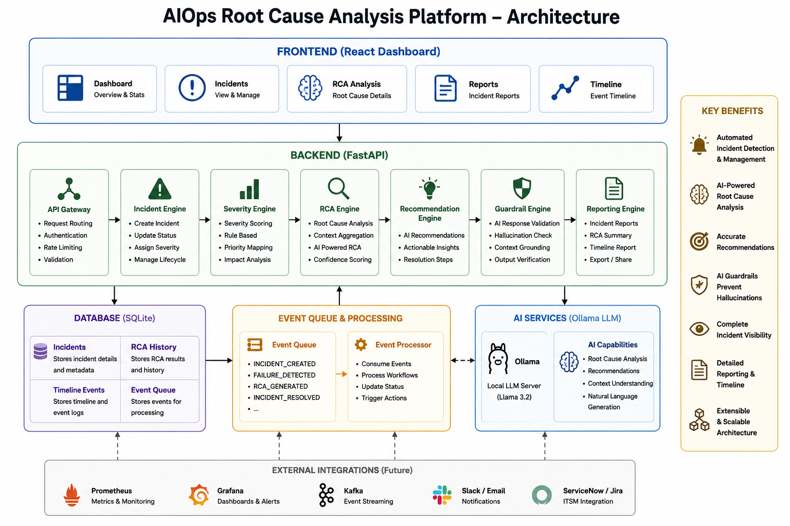

# AI Ops Root Cause Analysis Platform

> An AI-powered incident intelligence platform that automatically detects failures, creates incidents, performs root cause analysis, generates recommendations, validates AI outputs with guardrails, and produces operational reports.



---

# Overview

Modern engineering teams spend significant time investigating production incidents.

When a service fails, engineers must answer:

* What failed?
* Why did it fail?
* Which systems are impacted?
* What actions should be taken?

This project automates that workflow using AI-powered Root Cause Analysis (RCA), severity classification, event-driven processing, and operational reporting.

The platform simulates real-world AIOps and Site Reliability Engineering (SRE) workflows used in modern cloud-native environments.

---

# Key Features

## Incident Management

* Automated incident creation
* Incident lifecycle tracking
* Timeline generation
* Status management

## AI-Powered Root Cause Analysis

* Local LLM integration using Ollama
* Automated RCA generation
* Recommendation generation
* Confidence-based analysis

## Severity Classification

* Dynamic P0 / P1 / P2 / P3 assignment
* Latency-based classification
* Failure-type based prioritization

## Event-Driven Processing

* Internal event queue
* Asynchronous workflow simulation
* Future Kafka-ready architecture

## AI Guardrails

* Context grounding validation
* Hallucination prevention
* Recommendation verification

## Reporting Engine

* Incident reports
* RCA summaries
* Timeline reports
* Operational insights

## Testing

* Pytest-based unit tests
* Severity engine validation
* Guardrail validation
* API health validation

---

# Architecture

```text
┌─────────────────────────────┐
│       React Dashboard       │
└─────────────┬───────────────┘
              │
              ▼
┌─────────────────────────────┐
│        FastAPI APIs         │
└─────────────┬───────────────┘
              │
 ┌────────────┼────────────┐
 ▼            ▼            ▼

Incident   RCA Engine   Event Engine
Engine     + AI         Processing

 ▼            ▼            ▼

 SQLite    Ollama     Event Queue

              ▼

       Guardrail Layer

              ▼

       Reporting Layer
```

Detailed documentation:

* docs/architecture.md
* docs/system-design.md

---

# Technology Stack

## Frontend

* React
* Vite
* CSS

## Backend

* FastAPI
* Python

## Database

* SQLite

## AI

* Ollama
* Llama 3.2

## Testing

* Pytest

## Containerization

* Docker
* Docker Compose

---

# Project Structure

```text
aiops-root-cause-platform
│
├── backend
│   ├── app
│   │   ├── api
│   │   ├── services
│   │   ├── repositories
│   │   ├── models
│   │   └── core
│   │
│   ├── tests
│   └── Dockerfile
│
├── frontend
│   ├── src
│   └── Dockerfile
│
├── docs
│   ├── architecture.md
│   ├── system-design.md
│   └── architecture.png
│
├── screenshots
│
└── docker-compose.yml
```

---

# End-to-End Workflow

```text
Failure Injection
        │
        ▼
Incident Creation
        │
        ▼
Severity Assignment
        │
        ▼
Event Published
        │
        ▼
AI RCA Generation
        │
        ▼
Guardrail Validation
        │
        ▼
Incident Report Generation
```

---

# Running Locally

## Backend

```bash
cd backend

python -m venv venv
source venv/bin/activate

pip install -r requirements.txt

uvicorn app.main:app --reload
```

Backend URL:

```text
http://localhost:8000
```

Swagger Docs:

```text
http://localhost:8000/docs
```

---

## Frontend

```bash
cd frontend

npm install
npm run dev
```

Frontend URL:

```text
http://localhost:5173
```

---

# Running with Docker

```bash
docker compose up --build
```

Frontend:

```text
http://localhost:5173
```

Backend:

```text
http://localhost:8000
```

API Docs:

```text
http://localhost:8000/docs
```

---

# Sample APIs

## Inject Failure

```http
POST /api/failures/inject/redis_timeout
```

## View Incidents

```http
GET /api/incidents
```

## Generate AI RCA

```http
GET /api/ai-rca/{incident_id}
```

## Validate Guardrails

```http
GET /api/guardrails/incident/{incident_id}
```

## Generate Incident Report

```http
GET /api/reports/incident/{incident_id}
```

---

# Testing

Run all tests:

```bash
python -m pytest
```

Current coverage:

* Severity Engine
* Guardrail Engine
* Health API

Example output:

```text
8 passed
```

---

# Engineering Highlights

This project demonstrates:

* Backend Engineering
* Distributed Systems Concepts
* Event-Driven Architecture
* AI Integration
* Local LLM Deployment
* Root Cause Analysis
* SRE Workflows
* API Design
* Unit Testing
* Dockerization
* System Design

---

# What This Project Demonstrates

This project showcases practical software engineering skills across:

### Backend Engineering
- FastAPI
- REST APIs
- Service Layer Architecture
- Repository Pattern

### AI Engineering
- Ollama Integration
- LLM-Powered RCA
- Recommendation Generation
- Hallucination Guardrails

### Platform Engineering
- Incident Management
- Event Processing
- Severity Classification
- Operational Reporting

### DevOps & Quality
- Docker
- Docker Compose
- Pytest
- Automated Validation

### System Design
- Modular Architecture
- Event-Driven Design
- Production-Inspired AIOps Workflows

---

# Author

**Prince Levin Panditi**

Backend Engineer | AI Engineer | Distributed Systems Enthusiast

GitHub: https://github.com/princelevin

LinkedIn: https://www.linkedin.com/in/prince-levin/
